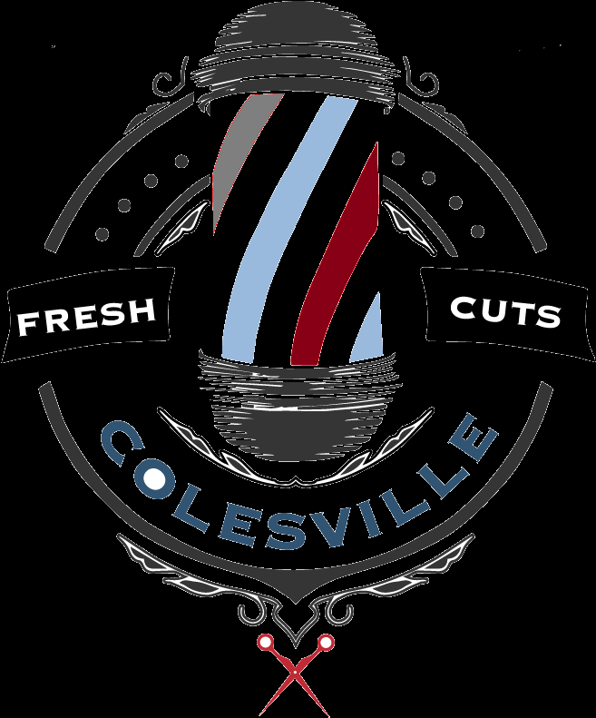

<p align="center">
  
</p>

<h1 align="center">Hair Studio</h1>

<p align="center">
  <strong>Professional Hair Salon Management & E-Commerce Platform</strong>
</p>

<p align="center">
  <a href="#features">Features</a> •
  <a href="#tech-stack">Tech Stack</a> •
  <a href="#installation">Installation</a> •
  <a href="#usage">Usage</a> •
  <a href="#documentation">Documentation</a>
</p>

<p align="center">
  
  
  
  
</p>

---

## Overview

**Hair Studio** is a comprehensive full-stack web application built for hair salon businesses. It provides a complete solution for managing online bookings, product sales, customer relationships, and staff operations through an intuitive web interface.

The platform implements a robust role-based access control system supporting three distinct user types:

| Role | Description |
|:-----|:------------|
| **Customer** | Browse services, purchase products, book appointments, manage profile |
| **Staff** | Process orders, manage inventory, handle customer bookings |
| **Administrator** | Full system control, staff management, account approvals |

---

## Features

<table>
<tr>
<td width="33%" valign="top">

### Customer Portal
- Secure registration & login
- BCrypt password encryption
- Service & product browsing
- Shopping cart management
- Order placement & tracking
- Profile customization
- Order history view

</td>
<td width="33%" valign="top">

### Staff Dashboard
- Dedicated management portal
- Order processing & updates
- Product CRUD operations
- Inventory management
- Customer order handling
- Status tracking system

</td>
<td width="33%" valign="top">

### Admin Console
- Staff account management
- User approval workflow
- Product catalog control
- System-wide oversight
- Account status management
- Comprehensive reporting

</td>
</tr>
</table>

---

## Tech Stack

<table>
<tr>
<td align="center" width="20%">

<br><strong>C#</strong>
<br><sub>Backend Logic</sub>
</td>
<td align="center" width="20%">

<br><strong>ASP.NET</strong>
<br><sub>Web Forms 4.7.2</sub>
</td>
<td align="center" width="20%">

<br><strong>SQL Server</strong>
<br><sub>Database</sub>
</td>
<td align="center" width="20%">

<br><strong>Bootstrap</strong>
<br><sub>UI Framework</sub>
</td>
<td align="center" width="20%">

<br><strong>jQuery</strong>
<br><sub>Frontend</sub>
</td>
</tr>
</table>

### Additional Technologies

| Component | Technology | Purpose |
|:----------|:-----------|:--------|
| Data Display | jQuery DataTables | Interactive table management |
| Icons | Font Awesome | UI iconography |
| Security | BCrypt.Net | Password hashing |
| Server | IIS Express / IIS | Web hosting |

---

## Prerequisites

Ensure you have the following installed before proceeding:

- **Visual Studio 2017+** (2022 recommended) — [Download](https://visualstudio.microsoft.com/)
- **.NET Framework 4.7.2** — [Download](https://dotnet.microsoft.com/download/dotnet-framework/net472)
- **SQL Server** (Express or higher) — [Download](https://www.microsoft.com/en-us/sql-server/sql-server-downloads)
- **IIS Express** (included with Visual Studio)

---

## Installation

### 1. Clone the Repository

```bash
git clone https://github.com/Naieem-55/HairStudio2.git
cd HairStudio2
```

### 2. Open in Visual Studio

```
File → Open → Project/Solution → Select HairStudio.sln
```

### 3. Restore Dependencies

```
Tools → NuGet Package Manager → Package Manager Console
```
```powershell
Update-Package -reinstall
```

### 4. Database Setup

Create a new database named `hairStudioDb` in SQL Server and execute the schema scripts.

### 5. Configure Connection String

Update `HairStudio/Web.config` with your SQL Server details:

```xml
<connectionStrings>
  <add name="con"
       connectionString="Data Source=YOUR_SERVER\SQLEXPRESS;Initial Catalog=hairStudioDb;Integrated Security=true"
       providerName="System.Data.SqlClient" />
</connectionStrings>
```

> **Note:** Replace `YOUR_SERVER` with your SQL Server instance name (e.g., `DESKTOP-ABC123\SQLEXPRESS`)

### 6. Build & Run

```
Build → Build Solution (Ctrl+Shift+B)
Debug → Start Debugging (F5)
```

---

## Usage

### Application URL

```
https://localhost:44341/homePage.aspx
```

### Access Points

| Portal | Navigation | Credentials |
|:-------|:-----------|:------------|
| **Customer** | Homepage → Login/Sign Up | Self-registration |
| **Staff** | Footer → Staff Login | Requires admin approval |
| **Admin** | Footer → Admin Login | Pre-configured in database |

### Initial Setup Workflow

```
1. Insert admin credentials directly into adminTBL
2. Admin logs in and approves staff registrations
3. Staff can then process customer orders
4. Customers self-register and place orders
```

---

## Project Architecture

```
HairStudio2/
│
├── HairStudio.sln                    # Solution file
│
└── HairStudio/
    │
    ├── Web.config                    # Configuration & connection strings
    ├── Site1.Master                  # Master page template
    │
    ├── App_Code/
    │   └── SecurityHelper.cs         # Security utilities (validation, CSRF, file upload)
    │
    ├── Authentication/
    │   ├── userLogin.aspx            # Customer authentication
    │   ├── userSignUp.aspx           # Customer registration
    │   ├── adminLogin.aspx           # Admin authentication
    │   ├── stuffLogin.aspx           # Staff authentication
    │   └── stuffSignUp.aspx          # Staff registration
    │
    ├── Customer/
    │   ├── homePage.aspx             # Landing page
    │   ├── userProfile.aspx          # Profile management
    │   ├── cartPage.aspx             # Shopping cart
    │   ├── makeOrder.aspx            # Product ordering
    │   ├── OrderHairStyle.aspx       # Service booking
    │   ├── makePayment.aspx          # Payment processing
    │   └── aboutUs.aspx              # Information page
    │
    ├── Catalog/
    │   ├── ourProducts.aspx          # Product listing
    │   └── hairStyle.aspx            # Services listing
    │
    ├── Management/
    │   ├── adminManagement.aspx      # Admin dashboard
    │   └── stuffManagementPage.aspx  # Staff dashboard
    │
    ├── Assets/
    │   ├── CSS/                      # Custom stylesheets
    │   ├── Bootstrap/                # Bootstrap framework
    │   ├── DataTables/               # DataTables plugin
    │   ├── FontAwesome/              # Icon library
    │   ├── Images/                   # Static assets
    │   └── imageStore/               # User uploads
    │
    └── Properties/
        └── AssemblyInfo.cs           # Assembly metadata
```

---

## Database Schema

### Entity Relationship

```
┌─────────────┐       ┌─────────────┐       ┌─────────────┐
│   adminTBL  │       │   userTBL   │       │  stuffTBL   │
├─────────────┤       ├─────────────┤       ├─────────────┤
│ adminId(PK) │       │ userId(PK)  │       │ stuffId(PK) │
│ name        │       │ name        │       │ name        │
│ password    │       │ email       │       │ email       │
└─────────────┘       │ phone       │       │ password    │
                      │ address     │       │ joinDate    │
                      │ password    │       │ status      │
                      │ status      │       └─────────────┘
                      │ imgLink     │
                      └──────┬──────┘
                             │
                             │ 1:N
                             ▼
                      ┌─────────────┐
                      │  orderTBL   │
                      ├─────────────┤
                      │ orderId(PK) │
                      │ userId(FK)  │
                      │ quantity    │
                      │ date        │
                      │ status      │
                      │ imgLink     │
                      └─────────────┘
```

### Table Definitions

<details>
<summary><strong>userTBL</strong> — Customer Accounts</summary>

| Column | Type | Description |
|:-------|:-----|:------------|
| userId | INT (PK) | Unique identifier |
| name | VARCHAR(100) | Full name |
| phone | VARCHAR(20) | Contact number |
| email | VARCHAR(100) | Email address |
| state | VARCHAR(50) | State/Province |
| city | VARCHAR(50) | City |
| zipCode | VARCHAR(10) | Postal code |
| address | VARCHAR(255) | Street address |
| password | VARCHAR(255) | BCrypt hash |
| accountStatus | VARCHAR(20) | pending/active/inactive |
| imgLink | VARCHAR(255) | Profile image path |

</details>

<details>
<summary><strong>orderTBL</strong> — Order Records</summary>

| Column | Type | Description |
|:-------|:-----|:------------|
| orderId | INT (PK) | Unique identifier |
| userId | INT (FK) | Customer reference |
| quantity | INT | Item quantity |
| date | DATE | Order date |
| status | VARCHAR(20) | Order status |
| imgLink | VARCHAR(255) | Product image |

</details>

<details>
<summary><strong>stuffTBL</strong> — Staff Accounts</summary>

| Column | Type | Description |
|:-------|:-----|:------------|
| stuffId | INT (PK) | Unique identifier |
| name | VARCHAR(100) | Staff name |
| password | VARCHAR(255) | BCrypt hash |
| joinDate | DATE | Employment date |
| email | VARCHAR(100) | Contact email |
| accountStatus | VARCHAR(20) | Account status |

</details>

<details>
<summary><strong>adminTBL</strong> — Administrator Accounts</summary>

| Column | Type | Description |
|:-------|:-----|:------------|
| adminId | INT (PK) | Unique identifier |
| name | VARCHAR(100) | Admin name |
| password | VARCHAR(255) | Password |

</details>

---

## Security Implementation

This application implements comprehensive security measures following OWASP guidelines.

### Security Features

<table>
<tr>
<td width="50%" valign="top">

#### Authentication & Authorization
| Feature | Implementation |
|:--------|:---------------|
| Password Hashing | BCrypt.Net with automatic salt |
| Session Management | Secure session handling with timeout |
| Role-Based Access | Customer, Staff, Admin roles |
| Login Protection | Input validation on all auth forms |

</td>
<td width="50%" valign="top">

#### Data Protection
| Feature | Implementation |
|:--------|:---------------|
| SQL Injection Prevention | Parameterized queries throughout |
| XSS Prevention | Output encoding & safe alerts |
| CSRF Protection | ViewState tokens on all forms |
| Input Validation | Server-side validation on all inputs |

</td>
</tr>
</table>

### Security Helper Class

The application includes a dedicated `SecurityHelper` class (`App_Code/SecurityHelper.cs`) providing:

```csharp
// Input Validation
SecurityHelper.IsValidEmail(email)      // Email format validation
SecurityHelper.IsValidPhone(phone)      // Phone number validation
SecurityHelper.IsValidPassword(pass)    // Password strength check (8+ chars, letter + number)
SecurityHelper.IsValidId(id)            // Alphanumeric ID validation
SecurityHelper.IsValidDecimal(price)    // Numeric validation

// File Upload Security
SecurityHelper.ValidateUploadedFile(file)   // Validates file type, size, content
SecurityHelper.SaveUploadedFile(file, path) // Secure file saving with GUID rename

// XSS Prevention
SecurityHelper.CreateSafeAlert(message)     // Safe JavaScript alerts
SecurityHelper.HtmlEncode(input)            // HTML encoding for output

// Session Security
SecurityHelper.GetSessionValue(session, key)  // Safe session access
SecurityHelper.IsAuthenticated(session)       // Auth check
SecurityHelper.ClearSession(session)          // Proper logout
```

### File Upload Security

| Protection | Description |
|:-----------|:------------|
| File Type Validation | Only allows `.jpg`, `.jpeg`, `.png`, `.gif`, `.bmp` |
| Content-Type Check | Validates MIME type matches extension |
| Size Limit | Maximum 5MB per file |
| Filename Sanitization | Replaces filename with GUID to prevent traversal |
| Double Extension Check | Blocks files like `image.jpg.exe` |

### Password Requirements

- Minimum 8 characters
- At least one letter (a-z, A-Z)
- At least one number (0-9)
- Stored using BCrypt with automatic salt generation

### Implemented OWASP Protections

| OWASP Top 10 | Status | Implementation |
|:-------------|:-------|:---------------|
| A01 - Broken Access Control | ✅ Protected | Role-based page access, session validation |
| A02 - Cryptographic Failures | ✅ Protected | BCrypt password hashing, HTTPS |
| A03 - Injection | ✅ Protected | Parameterized SQL queries throughout |
| A04 - Insecure Design | ✅ Protected | Security helper class, validation layer |
| A05 - Security Misconfiguration | ⚠️ Review | Update Web.config for production |
| A06 - Vulnerable Components | ⚠️ Review | Consider upgrading BCrypt.Net package |
| A07 - Auth Failures | ✅ Protected | Secure session management, password validation |
| A08 - Data Integrity Failures | ✅ Protected | CSRF tokens, input validation |
| A09 - Logging Failures | ⚠️ Partial | Debug logging implemented |
| A10 - SSRF | ✅ N/A | No external URL fetching |

### Production Deployment Checklist

- [ ] Set `debug="false"` in Web.config
- [ ] Configure HTTPS with valid SSL certificate
- [ ] Update connection strings for production database
- [ ] Enable custom error pages
- [ ] Configure session timeout appropriately
- [ ] Review and harden IIS settings
- [ ] Implement rate limiting for login attempts
- [ ] Set up proper logging and monitoring

---

## Configuration Reference

### Web.config Settings

| Setting | Value | Description |
|:--------|:------|:------------|
| targetFramework | 4.7.2 | .NET Framework version |
| debug | true/false | Compilation mode |
| SSL Port | 44341 | HTTPS port |
| Session Mode | InProc | Session state storage |

### IIS Express Configuration

```xml
<UseIISExpress>true</UseIISExpress>
<IISExpressSSLPort>44341</IISExpressSSLPort>
<IISExpressAnonymousAuthentication>enabled</IISExpressAnonymousAuthentication>
```

---

## Contributing

We welcome contributions! Please follow these steps:

1. **Fork** the repository
2. **Create** a feature branch
   ```bash
   git checkout -b feature/YourFeature
   ```
3. **Commit** your changes
   ```bash
   git commit -m "Add YourFeature"
   ```
4. **Push** to the branch
   ```bash
   git push origin feature/YourFeature
   ```
5. **Open** a Pull Request

### Contribution Guidelines

- Follow existing code style and conventions
- Write meaningful commit messages
- Update documentation for new features
- Test thoroughly before submitting

---

## License

This project is licensed under the **MIT License**.

```
MIT License

Copyright (c) 2024 Hair Studio

Permission is hereby granted, free of charge, to any person obtaining a copy
of this software and associated documentation files (the "Software"), to deal
in the Software without restriction, including without limitation the rights
to use, copy, modify, merge, publish, distribute, sublicense, and/or sell
copies of the Software, and to permit persons to whom the Software is
furnished to do so, subject to the following conditions:

The above copyright notice and this permission notice shall be included in all
copies or substantial portions of the Software.
```

---

## Contact & Support

For questions, issues, or feature requests:

- **Issues:** [GitHub Issues](https://github.com/Naieem-55/HairStudio2/issues)
- **Repository:** [github.com/Naieem-55/HairStudio2](https://github.com/Naieem-55/HairStudio2)

---

<p align="center">
  <strong>Built with ASP.NET Web Forms</strong>
  <br>
  <sub>Developed for modern hair salon businesses</sub>
</p>
